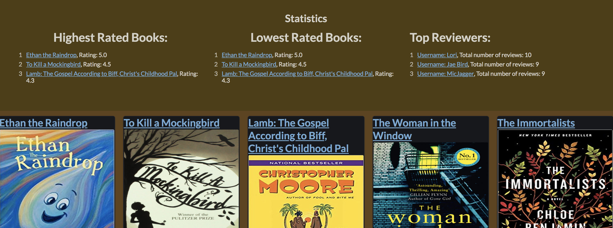
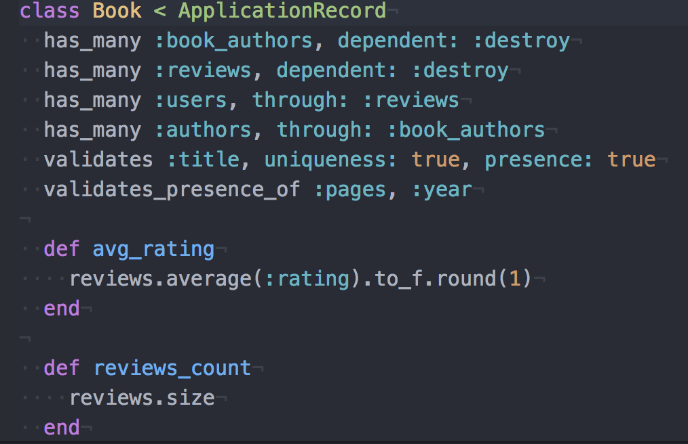

# Book Club
https://lit-meadow-97541.herokuapp.com/

A Turing School paired project created with Rails.


We created an online application where users can browse and review books and authors. A user can add, update, or delete a book, a review, or an author.  Visitors may also sort books by a number of categories, including by total reviews, ascending or descending rating, and by number of pages.



## Learning Goals
The primary goal of this challenge was learning how to set up many-to-many relationships and accessing attributes through multiple models.

* Creation of a basic Rails web application
* Implementing basic MVC structure
* Save and retrieve data from a database
* Display content on a web page with basic styling
* Testing code effectively at a Controller and Model level

## Getting Started && Prerequisites

You will need Rails v 5.1.
```
gem install rails -v 5.1
```
Clone down this repo!

```
git clone https://github.com/le3ah/book_club
```

### Installing

From your terminal, navigate into the book_club directory
```
cd book_club
```

Make sure your gemfile is up to date:

```
bundle
bundle update
```
Establish a database:

```
rake db:{drop,create,migrate,seed}
```
Start your server:

```
rails s
```

Open your browser (best functionality in Chrome).

`localhost:3000`

Welcome to our dev environment!


## Running the tests

Your location should be the root directory of the project (`book_club`).

From the command line run `rspec`
(This can take a moment)

`Green` is passing.
`Red` is failing.

We used `rspec`, `capybara`, and `shoulda-matchers` for testing.

##### Example of a feature test:

```  it 'should create new book with multiple authors and a space' do
    book_title = "See Spot Run"
    author_1 = 'Billy Madison'
    author_2 = 'Happy Gilmore'

    visit new_book_path

    fill_in :book_title, with: book_title
    fill_in :book_year, with: 1974
    fill_in :book_pages, with: 52
    fill_in :book_authors, with: "#{author_1}, #{author_2}"
    click_on 'Create Book'

    expect(current_path).to eq("/books/#{Book.last.id}")
    expect(page).to have_content(book_title)
    expect(page).to have_content(author_1)
    expect(page).to have_content(author_2)
  end
  ```

##### Example of a Controller Method:

```  def create
    rp = review_params
    @user = User.find_or_create_by(name: rp[:user])
    @book = Book.find(params[:book_id])
    @review = @book.reviews.create(user_id: @user.id, title: rp[:title], description: rp[:description], rating: rp[:rating].to_i)

    if @review.save
      redirect_to book_path(@review.book)
    else
      render :new
    end
  end
  ```

##### Example of a model:



## ActiveRecord Queries and Statistics
We worked with a relational database and queries with many to many relationships.

## Deployment

Our app is deployed on heroku at: [Book Club](https://lit-meadow-97541.herokuapp.com/)

`https://lit-meadow-97541.herokuapp.com/`

## Built With

* `Rails` (and all it's magic)
* Along with these gems:
  * `Rspec`
  * `Capybara`
  * `ShouldaMatchers`...and more!

## Contributing Members

* J Aaron Brooks Roberts
* Leah K Miller
